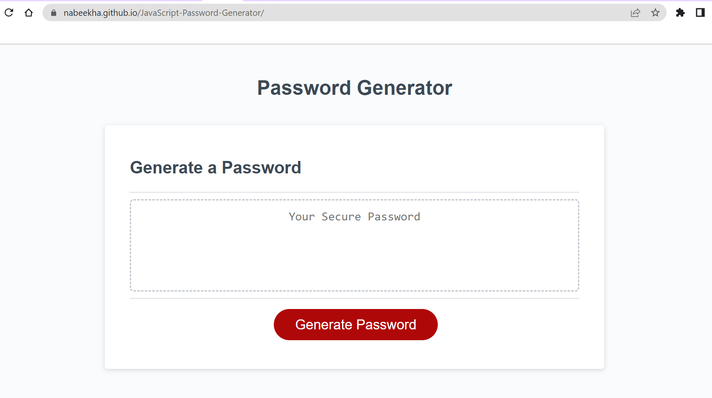

# <Password Generator Application>

## Description

Provide a short description explaining the what, why, and how of your project. Use the following questions as a guide:

This project was built to utilize JavaScript to create backend functionality in websites. By creating this, I am able to improve my understanding of how a front-end website speaks to a backend server. This project creates a password generator, and thus increases security for any websites I build in the future. My motivation was to improve security and learn more about JavaScript.

## Table of Contents (Optional)

If your README is long, add a table of contents to make it easy for users to find what they need.

- [Installation](#installation)
- [Usage](#usage)
- [Credits](#credits)
- [License](#license)

## Installation

To install this application, please go to the following repository: 
https://github.com/nabeekha/JavaScript-Password-Generator 

From this link, the application code can be downloaded.

## Usage

Provide instructions and examples for use. Include screenshots as needed.

To add a screenshot, create an `assets/images` folder in your repository and upload your screenshot to it. Then, using the relative file path, add it to your README using the following syntax:

Please view the deployed application link at the following location:
https://nabeekha.github.io/JavaScript-Password-Generator/

Please view screenshots of the application below:

## Credits

The only tutorial utilized within this application is the Georgia Tech coding bootcamp.

## License

MIT License

Copyright (c) [year] [fullname]

Permission is hereby granted, free of charge, to any person obtaining a copy
of this software and associated documentation files (the "Software"), to deal
in the Software without restriction, including without limitation the rights
to use, copy, modify, merge, publish, distribute, sublicense, and/or sell
copies of the Software, and to permit persons to whom the Software is
furnished to do so, subject to the following conditions:

The above copyright notice and this permission notice shall be included in all
copies or substantial portions of the Software.

THE SOFTWARE IS PROVIDED "AS IS", WITHOUT WARRANTY OF ANY KIND, EXPRESS OR
IMPLIED, INCLUDING BUT NOT LIMITED TO THE WARRANTIES OF MERCHANTABILITY,
FITNESS FOR A PARTICULAR PURPOSE AND NONINFRINGEMENT. IN NO EVENT SHALL THE
AUTHORS OR COPYRIGHT HOLDERS BE LIABLE FOR ANY CLAIM, DAMAGES OR OTHER
LIABILITY, WHETHER IN AN ACTION OF CONTRACT, TORT OR OTHERWISE, ARISING FROM,
OUT OF OR IN CONNECTION WITH THE SOFTWARE OR THE USE OR OTHER DEALINGS IN THE
SOFTWARE.

---

## Features

The primary features of this application are the use of JavaScript to write backend functionality. This provides the tool with various prompts that enable users to select various options for their code. 

## How to Contribute

No contribution is required at this time. Please feel free to provide insight!

## Tests 

Go the extra mile and write tests for your application. Then provide examples on how to run them here.